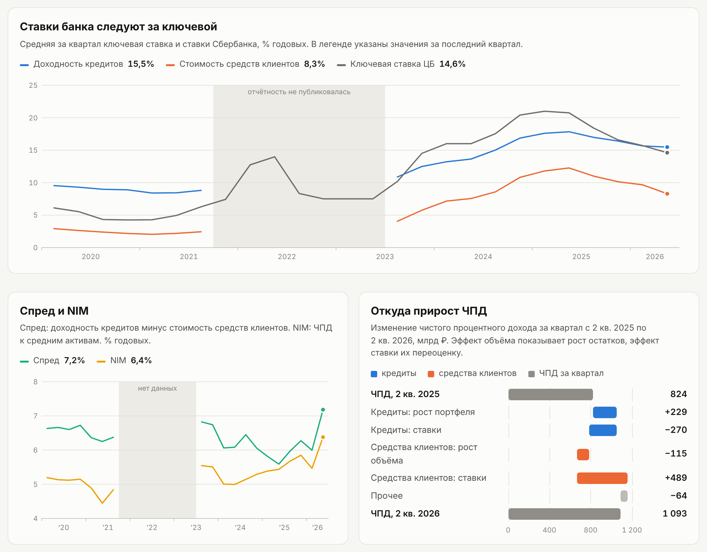
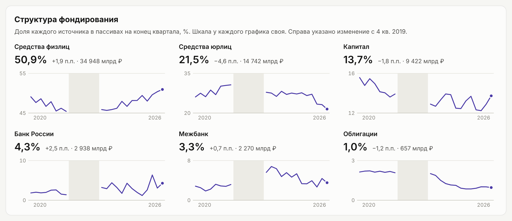

# Процентная маржа Сбербанка: NII, rate-volume и структура фондирования

Анализ чистого процентного дохода группы Сбербанк по публичной отчётности Банка России (формы 0409802 и 0409803) за 2020–2026 годы. Проект показывает, как ставки по кредитам и стоимость фондирования реагируют на ключевую ставку, раскладывает изменение ЧПД на эффекты объёма и ставки и прослеживает сдвиги в структуре пассивов.

*In English: net interest income analysis of Sberbank Group based on Bank of Russia regulatory filings (forms 0409802/0409803), 2020–2026: loan yield and funding cost vs. the key rate, deposit/loan betas, rate-volume decomposition of NII and funding mix.*



Дашборд целиком (одна HTML-страница, работает без интернета): [`docs/index.html`](docs/index.html). Для просмотра в браузере включите GitHub Pages (Settings → Pages → Deploy from a branch → папка `/docs`).

## Основные выводы

| | 2 кв. 2025 | 2 кв. 2026 |
|---|---|---|
| NIM | 5,4% | **6,4%** |
| Спред (доходность кредитов − стоимость средств клиентов) | 5,6% | **7,2%** |
| Доходность кредитов | 17,8% | 15,5% |
| Стоимость средств клиентов | 12,3% | 8,3% |
| Ключевая ставка, средняя за квартал | 20,8% | 14,6% |

- **На росте ставок фондирование дорожало быстрее кредитов.** С 2 кв. 2021 по 2 кв. 2025 ключевая ставка выросла на 15,8 п.п., стоимость средств клиентов на 10,1 п.п. (бета 0,64), доходность кредитов на 9,4 п.п. (бета 0,59). Клиентский спред сузился с 6,3% до 5,6%.
- **NIM при этом вырос** с 4,4% до 5,4%: при высоких ставках маржу держали капитал и портфель ценных бумаг, а не клиентский спред. Клиентская часть NIM снизилась с 3,6 до 2,7 п.п., остальная выросла с 0,8 до 2,7 п.п.
- **При снижении ставки эффект обратный.** За год ключевая ставка снизилась на 6,1 п.п., средства клиентов подешевели на 4,0 п.п. (бета 0,65), доходность кредитов снизилась на 2,4 п.п. (бета 0,39). Пассивы переоцениваются быстрее активов: баланс чувствителен по пассивам, и смягчение денежно-кредитной политики увеличивает ЧПД.
- **ЧПД за квартал вырос на 268 млрд ₽** (824 → 1 093 млрд ₽, 2 кв. 2025 → 2 кв. 2026). Удешевление средств клиентов дало +489 млрд, рост кредитного портфеля +229 млрд; снижение ставок по кредитам −270 млрд, рост объёма средств клиентов −115 млрд, прочее −64 млрд.
- **Фондирование стало более розничным.** Доля средств физлиц в пассивах выросла с 49,1% до 50,9%, доля юрлиц снизилась с 30,7% (3 кв. 2021) до 21,5%. Средства Банка России достигают максимума на конец года: 6,4% пассивов на конец 2025 года.



## Данные

Источник: [Банк России, отчётность кредитных организаций](https://www.cbr.ru/banking_sector/otchetnost-kreditnykh-organizaciy/), архивы DBF по всем банкам.

| Форма | Что содержит | Как используется |
|---|---|---|
| 0409802 | Консолидированный балансовый отчёт, остатки на отчётную дату | средние остатки кредитов, средств клиентов, активов; структура пассивов |
| 0409803 | Консолидированный отчёт о финансовых результатах, нарастающим итогом с начала года | процентные доходы и расходы, ЧПД |

Ключевая ставка: решения Банка России с датами вступления в силу, усреднённые по дням квартала.

Используемые строки:

- **802:** 4.1.2 (кредиты), 15.4 и 15.5 (средства юрлиц и физлиц), 14 (всего активов); для структуры фондирования также 16.1, 16.2, 15.1, 15.2, 15.3, 16.3, 15.6, 16.4, 34.
- **803, раздел I:** 1.2.2 (проценты по кредитам клиентам), 2.2 (проценты по средствам клиентов), 1 и 2 (процентные доходы и расходы всего), 1.5 и 2.4 (корректировки, исключаются).

### Особенности публичных данных

Большая часть работы ушла на то, чтобы ряды стали сопоставимыми:

- **Разрыв 4 кв. 2021 – 2 кв. 2023.** Банк России не публиковал отчётность банков из‑за санкционных рисков. На графиках разрыв показан, значения не интерполируются.
- **Формы 0409101/0409102 не подходят.** С 2024 года ЦБ публикует оборотную ведомость только по счетам первого порядка и объединяет часть счетов (например, 423 с 426), поэтому средства физлиц из неё не выделить. Консолидированные формы 802/803 этой проблемы не имеют.
- **Шаблоны форм менялись.** В 802 до 07.2021 строки раздела «Капитал» сдвинуты на одну; в 803 финансовый результат был 8-й строкой раздела II, стал 9-й. Строки старых периодов сопоставляются с последним отчётом по названию (названия берутся со страницы отчёта на сайте ЦБ), переносы печатаются для проверки.
- **Часть статей не раскрывается** (802: строки 7, 12, 19, 20, 24 после 2023 года), хотя итоги их включают. Остаток считается расчётными строками.
- **Корректировки 803, стр. 1.5 и 2.4** (разница между резервами по РСБУ и МСФО 9) до 2024 года раздували процентные доходы и расходы, затем перестали отражаться отдельно. Из-за этого квартальный ЧПД за 2 кв. 2024 по отчёту даёт ложный провал. В расчётах ЧПД берётся без этих строк.

## Методика

- **Квартальные суммы 803** = отчёт за текущий квартал минус предыдущий внутри года (отчёт на 01.04 уже равен первому кварталу).
- **Средний остаток** = (остаток на начало квартала + на конец) / 2.
- **Доходность кредитов** = проценты по кредитам за квартал × 4 / средние кредиты. Аналогично **стоимость средств клиентов**. **NIM** = ЧПД × 4 / средние активы. Умножение на 4 переводит квартальную ставку в годовую.
- **Rate-volume:** ΔI = (V₁ − V₀) × r₀ + (r₁ − r₀) × V₁, где V — средний остаток, r — квартальная ставка. Сумма эффектов точно равна изменению; совместный эффект ΔV × Δr отнесён к эффекту ставки.
- **Бета** = изменение ставки банка / изменение средней ключевой ставки за цикл (рост: 2 кв. 2021 → 2 кв. 2025; снижение: 2 кв. 2025 → 2 кв. 2026).

### Ограничения

- Бета посчитана «от точки до точки» и зависит от выбора концов периода; лаг переоценки она не показывает.
- Средний остаток по двум точкам сглаживает движение внутри квартала.
- В знаменатель доходности входят только кредиты по амортизированной стоимости (стр. 4.1.2), без кредитов по справедливой стоимости (стр. 6.3).
- Отчётность по РСБУ на консолидированной основе отличается от МСФО-отчётности Сбера.

## Структура репозитория

```
├── sber_802_803.ipynb        # загрузка форм ЦБ, сведение кварталов, метрики и rate-volume
├── build_dashboard.py        # сборка HTML-дашборда из CSV
├── dashboard_template.html   # шаблон дашборда (HTML/CSS/JS, графики на SVG без библиотек)
├── data/                     # результаты расчётов
│   ├── metrics.csv           # ставки, средние остатки, ЧПД по кварталам
│   ├── rate_volume.csv       # разложение изменения ЧПД
│   └── funding_mix.csv       # структура пассивов, млрд ₽
├── docs/
│   ├── index.html            # готовый дашборд
│   ├── dashboard.png
│   └── funding.png
└── requirements.txt
```

## Как воспроизвести

1. Установите зависимости: `pip install -r requirements.txt`.
2. Для распаковки RAR-архивов ЦБ нужна утилита `unrar` (на Windows `unrar.exe` от RARLab). Путь к ней задаётся в первой ячейке ноутбука (`rarfile.UNRAR_TOOL`).
3. В первой ячейке ноутбука укажите рабочую папку `WORKDIR` и при необходимости период `START`, `END`.
4. Запустите ноутбук `sber_802_803.ipynb` целиком. Шаг скачивания обращается к сайту ЦБ и кэширует архивы, повторные запуски идут из кэша. На выходе в папке `parsed`: `form802_all.parquet`, `form803_all.parquet`, `metrics.csv`, `rate_volume.csv`, `funding_mix.csv`, `sber_802_803.xlsx`.
5. Соберите дашборд: `python build_dashboard.py <папка с CSV> docs/index.html`.

Чтобы добавить новый квартал: увеличьте `END`, перезапустите ноутбук, допишите новые решения по ключевой ставке в список `KEY_RATE` в `build_dashboard.py` и пересоберите дашборд.

Другой банк: поменяйте `REGN` в первой ячейке (например, ВТБ — 1000) и очистите папку `line_names`, где кэшируются названия строк.

## Возможные расширения

- Чувствительность ЧПД к изменению ключевой ставки на текущем балансе (упрощённый NII sensitivity).
- Сравнение с другими крупными банками по тем же метрикам.
- Срочная структура вкладов по форме 0409101 за периоды до 2024 года.
- Нормативы капитала и ликвидности по форме 0409805.

## Автор

Лиференко Иван
